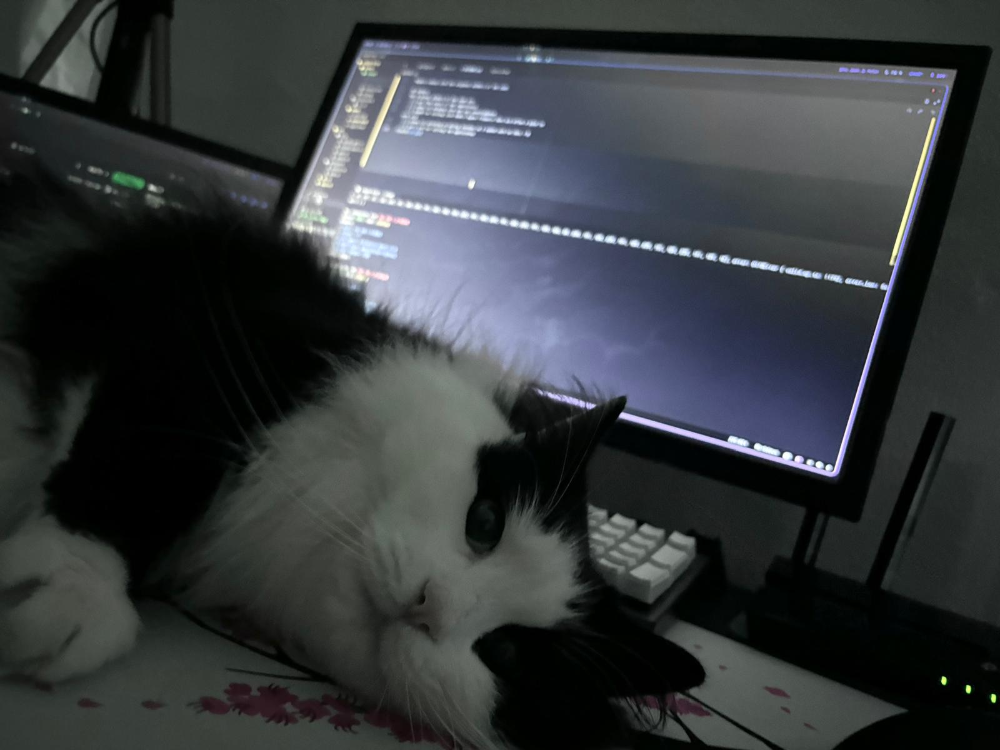

# Simple RUST custom HTTP Blog Page


## Description

This is a completly custom made HTTP server, it doesn't use any external library to handle the HTTP requests, it's all made from scratch.
This is **not** a production ready server, it's just a simple project to learn how to handle HTTP requests in RUST.
I am sure that my code can be substantially improved and refactored, this is my first real Rust project.

## Project Structure

The libraries used in this project are:

- **tokio**: To handle the asyncronous tasks.
  - **tokio::net::TcpListener**: To listen for incoming connections.
  - **tokio::io::AsyncReadExt**: To read the incoming data.
  - **tokio::io::AsyncWriteExt**: To write the response.
  - **tokio::fs**: To read the files from the disk.
- _uuid_: To generate the UUIDs.
- _sha256_: To hash the passwords.
- _base64_: To encode and decode the base64 strings.
- _urlencoding_: To encode and decode the URL strings.
- _json_: To parse and create JSON objects.
- _rusqlite_: To handle the SQLite database.
- _colored_: To color the output in the terminal

The following is the project tree structure:

```
src/
├── db.rs
├── http
│   ├── handle_get.rs
│   ├── handle_post.rs
│   ├── mod.rs
│   └── token.rs
├── main.rs
└── multipart
    ├── binary.rs
    └── mod.rs
```

- **db.rs**: Contains the functions to interact with the SQLite database.
- **http**: Contains the functions to handle the HTTP requests.
  - **handle_get.rs**: Contains the functions to handle the GET requests.
  - **handle_post.rs**: Contains the functions to handle the POST requests.
  - **mod.rs**: Publishes the functions to handle the HTTP requests.
  - **token.rs**: Contains the functions to handle the authentication tokens.
- **multipart**: Contains the functions to handle the multipart requests.
  - **binary.rs**: Contains the functions to handle the binary data sent in the multipart requests.
  - **mod.rs**: Handles the multipart requests and calls the functions to handle the binary data.
- **main.rs**: Contains the main function to start the server (TcpListener).

## Database Structure

The database has the following tables:

- **users**: Contains the users' data.
  - **email**: The email of the user
  - **password**: The hashed password of the user
  - Primary key: **_email_**
- **tokens**: Contains the tokens' data.
  - **token**: The token of the user
  - **email**: The email of the user
  - Primary key: **_email_**
  - Foreign key: **_email_** references **_users(email)_** on delete cascade
- **posts**: Contains the posts' data.
  - **post_id**: The UUID of the post
  - **email**: The email of the user that created the post
  - **title**: The title of the post
  - **content**: The content of the post
  - **image**: The UUID of the image of the post
  - **datetime**: The date and time of the post
  - Primary key: **_post_id_**
  - Foreign key: **_email_** references **_users(email)_** on delete cascade
- **comments**: Contains the comments' data.
  - **comment_id**: The UUID of the comment
  - **post_id**: The UUID of the post
  - **email**: The email of the user that created the comment
  - **content**: The content of the comment
  - **datetime**: The date and time of the comment
  - Primary key: **_comment_id_**
  - Foreign key: **_post_id_** references **_posts(post_id)_** on delete cascade
  - Foreign key: **_email_** references **_users(email)_** on delete cascade
- **reactions**: Contains the reactions' data (heart, like, dislike)
  - **reaction_id**: The UUID of the reaction
  - **post_id**: The UUID of the post
  - **email**: The email of the user that created the reaction
  - **type**: The reaction of the user
  - Primary key: **_reaction_id_**
  - Foreign key: **_post_id_** references **_posts(post_id)_** on delete cascade
  - Foreign key: **_email_** references **_users(email)_** on delete cascade


## How to run

To run the server, you need to have the RUST installed in your machine, you can install it by following the instructions in the [official website](https://www.rust-lang.org/tools/install).

After installing the RUST, you can clone this repository and run the following command in the root folder of the project:

```bash
cargo run
```

This will compile and run the server, you can access it by opening the browser and going to the address `http://<any>:8080`.

The `public` folder contains the files that will be served by the server, you can add more files to this folder and access them by going to the address `http://localhost:3000/<file_name>`.
If the extension of the file is in `["png", "jpg", "jpeg", "gif", "ico"]` the server will serve the file as a binary data, otherwise it will serve the file as a text data.

Posts' images are stored in the `public/images` folder as `asset-<uuid>.<ext>`, where `<uuid>` is the UUID of the post and `<ext>` is the extension of the image.

The server will create a SQLite database in the root folder of the project called `blog.db`, you can use the `sqlite3` command to access the database and see the tables and data.
I personally recommend adding the following script to the `.sqliterc` file in your home folder to make the output more readable:

```sql
.mode column
.headers on
.width 15 25 15
```
## APIs

Every API is in the route `/api`, the methods implemented are simply `GET` and `POST`, the following is the list of the APIs:
### GET
| Route | Description |
| --- | --- |
| **/api/posts** | Returns all the posts in the database |
| **/api/comments?post_id=<post_id>** | Returns all the comments of the post with the UUID `<uuid>` |
### POST
| Route | Description |
| --- | --- |
| **/api/login** | Receives the email and password of the user and returns a token |
| **/api/logout** | Receives the token of the user and deletes it from the database |
| **/api/upload** | Receives title, content and image of the post and creates a new post (needs the token to be authenticated) |

The upload API is a multipart request, the client must send the data in the following format:

```http
POST /api/upload HTTP/1.1
Host: <any>:8080
Content-Type: multipart/form-data; boundary=----WebKitFormBoundary7MA4YWxkTrZu0gW
Content-Length: 1234
Cookie: token=<token>
...

------WebKitFormBoundary7MA4YWxkTrZu0gW
Content-Disposition: form-data; name="title"

Title of the post
------WebKitFormBoundary7MA4YWxkTrZu0gW
Content-Disposition: form-data; name="content"

Content of the post
------WebKitFormBoundary7MA4YWxkTrZu0gW
Content-Disposition: form-data; name="image"; filename="image.jpg"
Content-Type: image/<ext>

<binary data of the image>
------WebKitFormBoundary7MA4YWxkTrZu0gW--
```

## Worth mentioning

- Content-Length Buffer Reader: The server uses a buffer reader to read the data from the client, this buffer reader reads the data until the end of the headers and then reads the body if there's a Content-Length header. This is an evolution from the old Semi-Dynamic Buffer, that has various problems with the reading of multipart requests. The following is the code of the buffer reader:

```rust
async fn handle_buffer_data(stream: &mut tokio::net::TcpStream) -> std::io::Result<Vec<u8>> {
  let mut reader = tokio::io::BufReader::new(stream);
  let mut request = Vec::new();
  let mut headers = Vec::new();
  let mut content_length = 0;

  // Read the headers
  loop {
    let mut line = String::new();
    reader.read_line(&mut line).await?;
    if line == "\r\n" {
      break;
    }
    if line.starts_with("Content-Length:") {
      let parts: Vec<&str> = line.split_whitespace().collect();
      if let Some(length_str) = parts.get(1) {
        content_length = length_str.parse::<usize>().unwrap_or(0);
      }
    }
    headers.push(line.clone());
    request.extend_from_slice(line.as_bytes());
  }

  // Read the body if there's a Content-Length
  if content_length > 0 {
    let mut body: Vec<u8> = vec![0; content_length];
    reader.read_exact(&mut body).await?;
    request.extend_from_slice("\r\n".as_bytes());
    request.extend_from_slice(&body);
  }

  Ok(request)
}
```
The `handle_connection` function calls this function asynchronously to read the data sent from the client, The following is the unwrapping:

```rust
let complete_buffer: Vec<u8> = match handle_buffer_data(&mut socket).await {
  Ok(buffer) => buffer,
  Err(_) => {
    println!("Error reading from socket");
    return;
  }
};
let string_buffer: std::string::String = String::from_utf8_lossy(&complete_buffer).to_string();
```

- Responsive UI: By using DaisyUI, the server has a responsive UI that adapts to the screen size, making it easier to use on mobile devices. The UI is very simple and has only the necessary elements to interact with the server.
- Authentication: The server uses a token-based authentication system, where the user sends the email and password to the server and the server returns a token that the user must use in the requests that require authentication.

## Profile Pictures
For the profile pictures, the server uses the Gravatar API to get the profile pictures of the users, the server uses the email of the user to get the profile picture, this removes the need of the user to upload a profile picture to the server and for the server to store the profile picture of the user.

The services used is [DiceBear Avatars](https://avatars.dicebear.com/) to generate the profile pictures of the users, is API is able to generate a profile picture based on a seed, thus by using deterministic algorithms.
There are multiple styles of profile pictures that can be generated, the server uses the `notionists-neutral` style, simple but original!
By providing the same seed, the server can generate the same profile picture for the same user, this way the server doesn't need to store the profile picture in any database.

The image is processed as an SVG image, this way the image can be resized without losing quality.
Example of the profile picture generated by the server:

```html
https://api.dicebear.com/8.x/notionists-neutral/svg?seed=rust.blog@zpx.it
```
Result:


## License

Currently, this code is under the GNU AFFERO GENERAL PUBLIC LICENSE Version 3, 19 November 2007.
Rights remain with the original authors of the code.

## Authors

The original authors of the code are:

- [x] [zpx](https://github.com/zzampax) (the owner of the repository)
- [x] [redux](https://github.com/th3-riddler) for helping with the sql intelliphense
- [x] [fba06](https://github.com/fba06) for testing with WebKit Apple Products that are often a pain to work with
- [x] [midee](https://github.com/MiDeee) for covering me during lessons so I could work on this >:D
- [x] **_zpx's cat_** for testing the application


